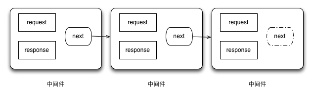
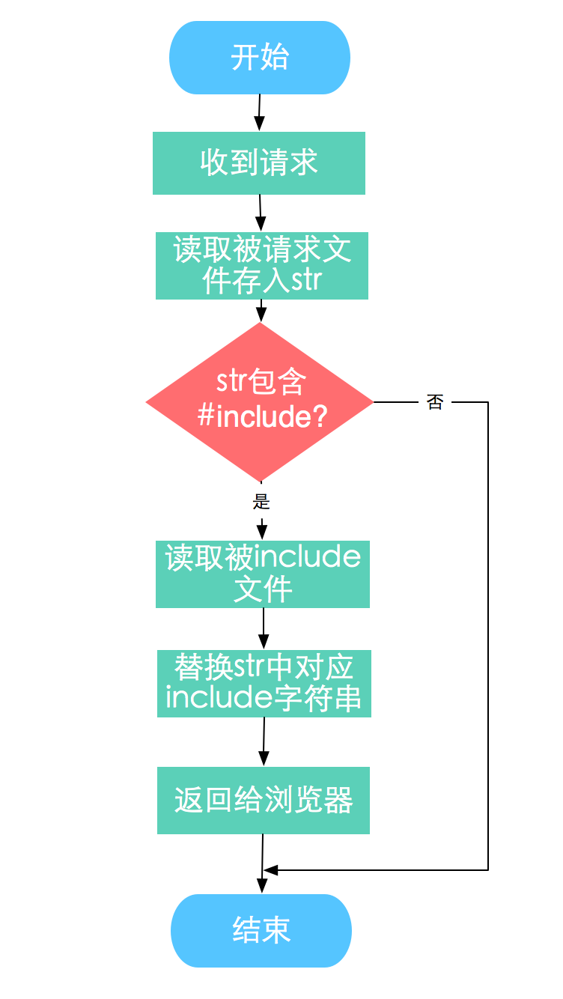

title: 如何编写一个connect中间件
date: 2014-07-12 21:20
categories:
- nodejs
tags:
- nodejs
- connect
- 中间件
---

# 1. connect简介

> Connect is a middleware framework for node.

Connect 是 nodejs 的中间件框架。何为中间件？中间件就是用户请求和返回结果之间的一个又一个筛选工具。正如 [@Luics](http://weibo.com/777865156?topnav=1&wvr=5&topsug=1) 所说“如果把一个http处理过程比作是污水处理，中间件就像是一层层的过滤网。”

中间件能在请求用户请求处理之前，进行一些预处理，而在返回结果之前，又进行一些返回之前的处理。非常类似于洋葱模型，一层一层的进入，又一层一层的退出。

Connect中间件的处理流程如下：



nodejs 中，http server 有两个参数传入，分别是 request 和 response 代表请求和响应结果，这两个参数也会被传入中间件中。此外，connect 中间件还有第三个参数：next 函数。通常使用该参数的方法是：`next();` 。因此大家常认为 next 代表下一个中间件函数，但事实上，next 只是 connect 生成的一个函数，它的作用是告诉 connect 可以调用下一个中间件来处理 request 和 response 了。如果下一个中间件，则调用，如果不存在，就没有调用了。

**参考:**更多关于conncet的介绍请访问以下链接：

1. [connect github page](https://github.com/senchalabs/connect)
2. [connect doc page](http://www.senchalabs.org/connect/)
3. [Luics 天猫鬼道 connect简介](http://www.cnblogs.com/luics/archive/2012/11/28/2775206.html)
4. [connct 内置中间件介绍](http://blog.fens.me/nodejs-connect/)
5. [深入浅出Node.js：Connect模块解析一](http://www.infoq.com/cn/articles/nodejs-connect-module)
6. [深入浅出Node.js：Connect模块解析二](http://www.infoq.com/cn/articles/nodejs-8-connect-module-part-2)

# 2. 一个简单的目标

看完简介和一些深入的介绍之后，我们就可以开始着手做一个自己的中间件来方便我们的web开发了。

## 需求

现在笔者有这么一个需求：在本地进行demo页面开发的时候，对静态页面进行模块式开发，实现html页面之间的引用。譬如，做一个公用的header或者footer，以便其他页面进行引用。

## 问题

在没有nodejs之前，可以通过对Apache服务器进行一些配置，以支持`[SSI(Server Side Include)](http://en.wikipedia.org/wiki/Server_Side_Includes)'命令。通过类似

```
`<!--#include virtual="./mod/header.html"-->`
```
的命令来实现引用。

现在在nodejs环境下开发，就没有了这种支持。所以我们要自己动手，丰衣足食。没有的，我们就自己创造工具。

# 3. 功能、接口设计

## 功能

要实现的功能非常简单——当服务器收到对html文件的请求时，将请求的html文件中的类似`<!--#include virtual="./mod/header.html"-->`的字符串替换成对应模块的html代码，然后将请求的内容返回给浏览器。

流程图如下：



## 接口


# 4. 代码实现

# 5. 中间件发布

# 6. 大功告成！


